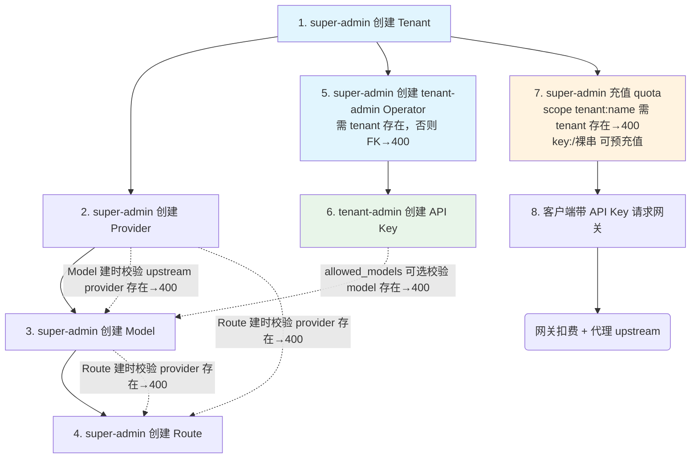

# Control Panel 业务流程与实体状态（domain-flows.md）

> 本文件是后端已强制但从未沉淀的业务/状态设计的**单一事实来源**。它指导 UI 设计、
> 校验错误展示、以及跨资源操作的一致性心智。后端契约见 `docs/openapi/admin.yaml`,
> ADR-0017 见权限模型（operator auth + 角色隔离）。

## 1. 运营 onboarding 依赖链

首次启用一个租户,运营必须按如下顺序操作。标注了角色、前置依赖、验证失败码。



**关键心智**：
- **写即生效**：每次 config 修改（provider/model/route/plugin upsert/delete）在同一事务内 bump `config_generation`。**无 staging/draft/approval 流程**。数据面通过轮询检测 version 变化后原子切换(默认 5s)。运营者应预期变更立即影响流量。
- **onboarding 可以跨越不同时间点进行**：不要求一口气完成。空列表和运行时 503 是状态的一部分。
- **quota 可预充值**：充值可以早于 key 创建（先充钱再发 key 是合法顺序）。

## 2. 实体生命周期 / 状态机

### 2.1 Provider / Model / Route / Plugin（config 类）

```
不存在 →（POST upsert）→ 存在 →（DELETE）→ 已删除
                          ↑
                     （DELETE 受引用保护）
```

- **引用保护**：删除一个 provider 时,系统检查是否有 model 的 `upstreams[].provider` 或 route 的 `providers[].name` 引用它；有则返回 **409**,包含引用详情。删除 model 时检查 route 的 `model_alias` 是否引用它。route/plugin 无下游引用,删除不设保护。
- **删除后**：provider 行从 DB 移除；引用它的 model/route spec 中保留名称（**没有级联清理**）。数据面对悬空引用**跳过**该 candidate 并尝试下一个,若全部不可用则返回 503。
- **Provider 的 name 是唯一标识**,不可改名；如需取代,应创建新 provider 后更新 model/route 引用再删旧的。

### 2.2 Tenant

```
不存在 →（POST /api/v1/tenants）→ enabled=true →（PATCH {enabled:false}）→ enabled=false
                                       ↑                                        │
                                       └────────（PATCH {enabled:true}）────────┘
```

- **可逆开关**：`PATCH /api/v1/tenants/{name} {enabled}` 切换 `tenants.enabled`（super-admin only）。与 `api_keys.revoked_at` 的不可逆软删不同——禁用后可重新启用。未知租户名 → 404。
- **运行时生效**：禁用在数据面鉴权边界强制（`internal/store/key.go` 的 `KeyRepo.LookupByHash`，JOIN 条件 `t.enabled = true`），该租户下所有 API Key 立即（下一次鉴权缓存过期后）被拒绝（401），不触碰 `api_keys` 表本身，也不影响 billing（quota 按 scope 字符串存储，鉴权已拒绝则不会进入 billing 阶段）。
- **仍无 DELETE 端点**：没有硬删除；无法彻底移除租户行，只能禁用。
- **租户名唯一**：不可改名。

### 2.3 Operator

```
不存在 →（POST /api/v1/operators）→ active →（DELETE）→ 已删除(sessions 级联撤销)
                                                         ↑
                                                   最后 super-admin→409
```

- **最后 super-admin 保护**：删除最后一个 super-admin 返回 409,防止平台不可管理。
- **级联撤销**：DELETE operator → `ON DELETE CASCADE` 删所有 sessions → token 即时失效。任何持有该 token 的浏览器会话在下一个请求被 401。
- **secret**：密码 argon2id 哈希,不存明文,不可找回。忘记密码需重新创建。

### 2.4 API Key

```
不存在 →（POST /api/v1/api-keys）→ active →（Revoke:DELETE）→ revoked(revoked_at)
                                                    ↑
                                              revoked 后不活跃,保留审计
```

- **软删**：`revoked_at` 设置时间戳,行保留在 DB 中用于审计。`ListAPIKeys` 过滤掉 revoked 的 key。
- **plaintext 仅创建时返回一次**：创建响应含 `api_key`(明文),之后**无法再次获取**。遗失需重新创建。
- **key_id 唯一且人类可读**：与明文 key 不同。明文 key 是 `sk-` + 24 随机字节(hex)。
- **created_at** 记录创建时间,可用于清理旧 key。

### 2.5 Quota

```
不存在→（TopUp）→ 有余额→（数据面扣减/后台充值）→ 更新
                       ↑
                 余额可降至 0（拒绝请求）或负数（欠费,不计）
```

- **原子增量**：充值用 `TopUp`（`balance += delta`,单条 SQL）,绝不覆盖。data plane 扣减用 `TryDebit`（条件 UPDATE, `balance >= est` 才扣）。
- **无存在性要求**：scope 是自由字符串（`tenant:X`/`group:X/Y`/`key:Z`/裸串）。`tenant:X` 格式的 X 必须为存在的租户名（防拼错），其余格式不校验存在（允许预充值）。
- **currency**：余额带有币种字段,多币种独立计数(eg, usd / cny)。
- **余额 0 或不存在 == unlimited** （对于 TryDebit）；TopUp 会创建不存在的 scope。

## 3. 空状态 / 引导 UX 约定

| 页面 | 0 数据状态 | 操作引导 |
|---|---|---|
| **provider 列表** | 无 provider → 创建表单 + "创建 provider 以开始配置" | 谁先创建第一个 provider 后,可见 Model/Route 页 |
| **model 列表** | 无 provider → 提示"需先创建 provider"并链接到 providers 页；有 provider 但无 model → 创建表单 | |
| **route 列表** | 无 provider 或 model → 提示依赖链；齐备后显示创建表单 | |
| **tenant 列表** | 无 tenant → 创建表单 | 需 super-admin |
| **operator 列表** | 至少总有一个(bootstrap 的 super-admin) | 创建新 operator |
| **api-key 列表** | 无 key → "你还没有 API key,单击创建" | tenant-admin 自管理界面 |
| **usage 页** | 无记录 → "尚无用量数据,配置完成后发送请求即可看到" | 被动展示,非可操作 |
| **audit 页** | 刚部署→无记录→"尚无审计日志,创建或修改资源后将自动记录" | 被动展示 |
| **quota 余额** | 未充值→余额 0 → "尚未为当前 scope 充值" + 充值按钮 | super-admin 可见充值 |

## 4. 校验错误 UX 约定

错误响应用 `internal/apperr` 的错误码作 `type`（详见 design/architecture.md「错误统一」、
design/frontend.md §12）。`message` 是 i18n key（如 `errors.tenant.tenantNotFound`），
前端 `mapBackendError()` 剥前缀后用 `useTranslations("errors")` 翻译。

| 错误类型 | HTTP | `type`（示例 code） | UI 展示 | i18n key 示例 |
|---|---|---|---|---|
| 缺/错字段 | 400 | `invalid_body` / `tenant_invalid_for_super_admin` | 表单内红色提示 | `errors.tenant.tenantInvalidForSuperAdmin` |
| 引用冲突(删除) | 409 | `provider_delete_failed` / `group_referenced` | 对话框/Toast："操作被拒绝" + 详情 | `errors.tenant.groupReferenced` |
| 认证过期/已登出 | 401 | `invalid_session` / `missing_bearer_token` | 清除 session →跳 /login | `errors.auth.invalidSession` |
| 权限不足 | 403 | `super_admin_required` / `tenant_admin_required` | Toast / 页面局部"无权限" | `errors.auth.superAdminRequired` |
| 登录失败/锁定 | 429 | `too_many_logins` | 表单内错误提示 | `errors.auth.tooManyLogins` |
| 凭据无效 | 401 | `invalid_credentials` | 表单内错误提示 | `errors.auth.invalidCredentials` |
| 不存在 | 404 | `tenant_not_found` / `api_key_not_found_in_tenant` / `operator_not_found` / `plugin_not_found` | Toast | `errors.tenant.tenantNotFound` |
| 配额不足 | 402 | `quota_insufficient` | Toast / 跳转充值 | `errors.quota.insufficient` |
| 运行时(DB 等) | 500 | `unexpected` / `snapshot_failed` | 通用错误页面 / 日志 | `errors.common.unexpected` |

**UI 层不重写值级校验规则**（design/frontend.md §8）。所有值级约束（delta>0、role/tenant 校验、email 格式等）依赖后端 400 typed error 展示。前端通过生成的 `AdminError`/`unwrap` 获得类型化错误。

## 5. 跨资源一致性心智

- **config 写即生效**:post/delete 后无需"发布"或"审批".下一个数据面轮询周期(默认 5s)内新配置生效.
- **删除引用保护**:删除 provider/model 时,系统会在 DELETE 前检查引用,有引用则拒绝(409).这是**写入时**的保护,不是运行时保护(数据面仍可跳过空的候选 provider).
- **quota scope 命名约定**:`tenant:<name>`, `group:<name>/<group>`, `key:<id>`.`tenant:` 前缀的 name 必须对应已存在的租户,否则 topup 拒绝(400).
- **立即生效的 session 撤销**:删除 operator 时,其所有 session 被级联删除(token 即时失效).UI 上任何 401 都应触发 clear session + redirect /login.
- **前端隐藏≠权限**:Navi 按角色显示或隐藏条目仅为 UX 体验.真正的权限管控在后端 403.前端角色守卫是 seam,需后端 /me 端点支持.
- **双向依赖**:model 的 upstreams 引用 provider;route 的 providers 引用 provider + model_alias 引用 model.删 provider 可能影响多个 model 和 route.

---

> 状态速查(2026-07):此前的"P2 缺口"（config 真编 PATCH）已由 [ADR-0030](../docs/adr/0030-config-patch-editing.md) 落地并完成 rollout。tenant 停用、API keys 撤销、groups CRUD 亦均已通过各自端点补齐（可逆开关）。Provider 凭证加密落库另见 [ADR-0031](../docs/adr/0031-provider-credential-encryption-at-rest.md)。
