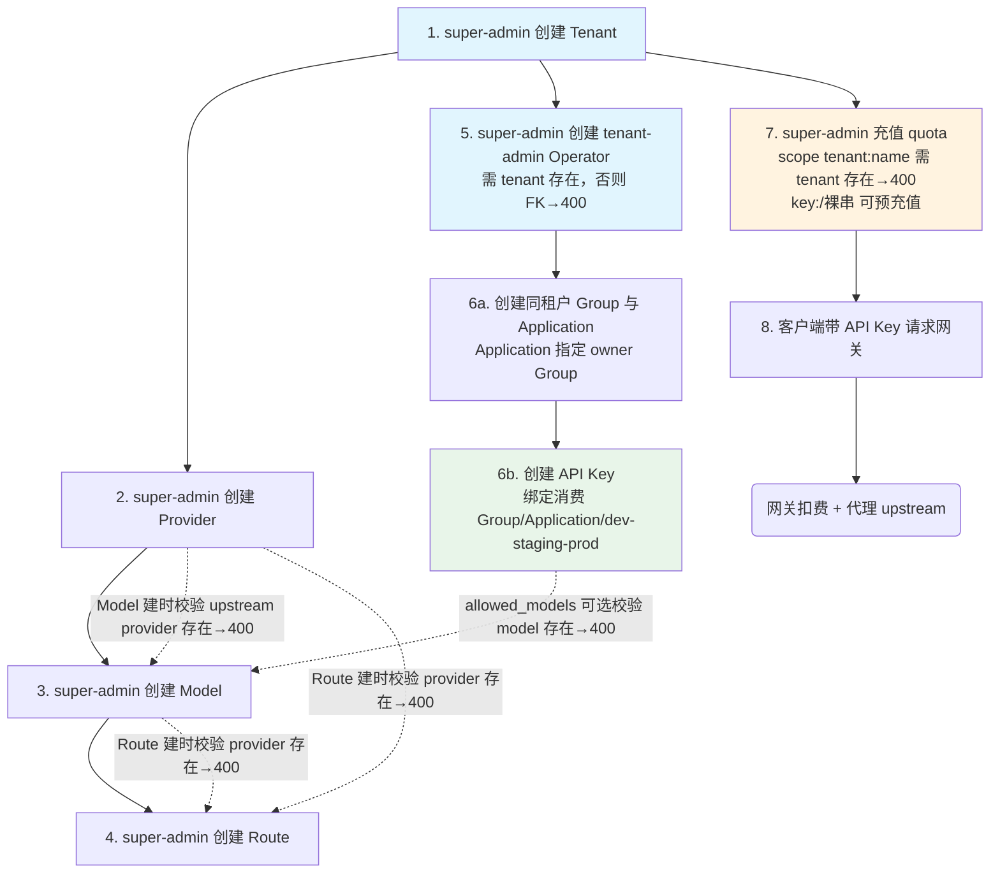

# Control Panel 业务流程与实体状态（domain-flows.md）

> 本文件是后端已强制但从未沉淀的业务/状态设计的**单一事实来源**。它指导 UI 设计、
> 校验错误展示、以及跨资源操作的一致性心智。后端契约见 `docs/openapi/admin.yaml`,
> ADR-0017 见权限模型（operator auth + 角色隔离）。

## 1. 运营 onboarding 依赖链

首次启用一个租户,运营必须按如下顺序操作。标注了角色、前置依赖、验证失败码。


```mermaid
flowchart TD
    A[1. super-admin 创建 Tenant] --> B[2. super-admin 创建 Provider]
    B --> C[3. super-admin 创建 Model]
    C --> D[4. super-admin 创建 Route]
    
    A --> E[5. super-admin 创建 tenant-admin Operator<br/>需 tenant 存在，否则 FK→400]
    E --> J[6a. 创建同租户 Group 与 Application<br/>Application 指定 owner Group]
    J --> F[6b. 创建 API Key<br/>绑定消费 Group/Application/dev-staging-prod]
    
    A --> G[7. super-admin 充值 quota<br/>scope tenant:name 需 tenant 存在→400<br/>key:/裸串 可预充值]
    G --> H[8. 客户端带 API Key 请求网关]
    H --> I(网关扣费 + 代理 upstream)
    
    B -.->|Model 建时校验 upstream provider 存在→400| C
    B -.->|Route 建时校验 provider 存在→400| D
    C -.->|Route 建时校验 provider 存在→400| D
    F -.->|allowed_models 可选校验 model 存在→400| C
    
    style A fill:#e1f5fe
    style E fill:#e1f5fe
    style G fill:#fff3e0
    style F fill:#e8f5e9
```

**关键心智**：
- **写即生效**：每次 config 修改（provider/model/route/plugin upsert/delete）在同一事务内 bump `config_generation`。**无 staging/draft/approval 流程**。数据面通过轮询检测 version 变化后原子切换(默认 5s)。运营者应预期变更立即影响流量。
- **onboarding 可以跨越不同时间点进行**：不要求一口气完成。空列表和运行时 503 是状态的一部分。
- **quota 可预充值**：充值可以早于 key 创建（先充钱再发 key 是合法顺序）。

## 2. 实体生命周期 / 状态机

### 2.1 Provider / Model / Route / Plugin（config 类）

```
不存在 →（POST upsert）→ 存在 →（DELETE）→ 已删除
                          ↑
                     （DELETE 受引用保护）
```

- **引用保护**：删除一个 provider 时,系统检查是否有 model 的 `upstreams[].provider` 或 route 的 `providers[].name` 引用它；有则返回 **409**,包含引用详情。删除 model 时检查 route 的 `model_alias` 是否引用它。route/plugin 无下游引用,删除不设保护。
- **删除后**：provider 行从 DB 移除；引用它的 model/route spec 中保留名称（**没有级联清理**）。数据面对悬空引用**跳过**该 candidate 并尝试下一个,若全部不可用则返回 503。
- **Provider 的 name 是唯一标识**,不可改名；如需取代,应创建新 provider 后更新 model/route 引用再删旧的。

### 2.2 Tenant

```
不存在 →（POST /api/v1/tenants）→ enabled=true →（PATCH {enabled:false}）→ enabled=false
                                       ↑                                        │
                                       └────────（PATCH {enabled:true}）────────┘
```

- **可逆开关**：`PATCH /api/v1/tenants/{name} {enabled}` 切换 `tenants.enabled`（super-admin only）。与 `api_keys.revoked_at` 的不可逆软删不同——禁用后可重新启用。未知租户名 → 404。
- **运行时生效**：禁用在数据面鉴权边界强制（`internal/store/key.go` 的 `KeyRepo.LookupByHash`，JOIN 条件 `t.enabled = true`），该租户下所有 API Key 立即（下一次鉴权缓存过期后）被拒绝（401），不触碰 `api_keys` 表本身，也不影响 billing（quota 按 scope 字符串存储，鉴权已拒绝则不会进入 billing 阶段）。
- **仍无 DELETE 端点**：没有硬删除；无法彻底移除租户行，只能禁用。
- **租户名唯一**：不可改名。

### 2.3 Operator

```
不存在 →（POST /api/v1/operators）→ active →（DELETE）→ 已删除(sessions 级联撤销)
                                                         ↑
                                                   最后 super-admin→409
```

- **最后 super-admin 保护**：删除最后一个 super-admin 返回 409,防止平台不可管理。
- **级联撤销**：DELETE operator → `ON DELETE CASCADE` 删所有 sessions → token 即时失效。任何持有该 token 的浏览器会话在下一个请求被 401。
- **secret**：密码 argon2id 哈希,不存明文,不可找回。忘记密码需重新创建。

### 2.4 API Key

```
不存在 →（POST /api/v1/api-keys）→ active →（Revoke:DELETE）→ revoked(revoked_at)
                                                    ↑
                                              revoked 后不活跃,保留审计
```

- **软删**：`revoked_at` 设置时间戳,行保留在 DB 中用于审计。`ListAPIKeys` 过滤掉 revoked 的 key。
- **plaintext 仅创建时返回一次**：创建响应含 `api_key`(明文),之后**无法再次获取**。遗失需重新创建。
- **key_id 唯一且人类可读**：与明文 key 不同。明文 key 是 `sk-` + 24 随机字节(hex)。
- **created_at** 记录创建时间,可用于清理旧 key。
- **企业新 Key 强绑定**：消费 Group、Application、`environment`（dev/staging/prod）全部必填，事务内校验同租户、实体存在与应用启用。应用 owner Group 不必等于消费 Group。调用方 header 不能覆盖可信 Key 身份。
- **历史补齐而非重新绑定**：`GET /api/v1/api-keys?unbound=true` 分页列出缺少治理身份的未撤销 Key；`PATCH /api/v1/api-keys/{key_id}` 仅补齐缺失身份，已有非空 Group/Application/environment 不能改变，完整绑定后不能解绑。迁移到别的应用/环境须发新 Key；已存在账本快照不回填。
- **授权分离**：读取检查 api_key.read，创建/补齐/撤销检查 api_key.write；Application 相应检查 application.read/write。tenant-admin 内置权限已补齐，但自定义只读角色不会因此得到写权限。

### 2.5 Quota

```
不存在→（TopUp）→ 有余额→（数据面扣减/后台充值）→ 更新
                       ↑
                 余额可降至 0（拒绝后续请求）；流式 in-flight 估算误差可短暂为负
```

- **原子增量**：充值用 `TopUp`（`balance += delta`），绝不覆盖。企业数据面由 `AccountingRepo` 在同一事务预留/结算旧余额与新预算，不再叠加一次旧 `TryDebit/Settle`。
- **scope**：保留 `tenant:X` / `group:X/Y` / `key:Z` / 裸串；tenant 前缀校验存在，其余允许预充值。Group 的租户名/组名分别 path-escape，创建与消费统一用 `billing.GroupScope` / `ParseGroupScope`；`group:<group>` 歧义历史项须显式核对，不能误判为无限额。
- **currency**：一个 scope 只有一种币种（如 usd/cny），不是一个 scope 内多币种账户；充值不得改变已有币种。所有可达候选价格及参与资金账户须同币种，不隐式换汇。
- **零余额语义**：scope 行不存在 == 该维度未限额；已存在余额 `<= 0` 时，即使估算为零也拒绝新请求。实际成本超过预留仍照实结算，可出现负余额，后续拒绝到余额恢复。输出估算不是全成本上界。

### 2.6 Application

应用属于一个 Tenant，有一个同租户 owner Group；owner 表示维护责任，Key 的 Group 表示消费归属。当前 PATCH 只切换 enabled，不提供名称/owner 修改；禁用拒绝所有绑定 Key，但不改写 Key 或历史账本。PATCH 返回更新后的 Application 对象。停用 Tenant/Application 或撤销 Key 均受鉴权缓存 TTL 约束（当前默认 1 分钟），不保证跨实例即时失效、不终止已开始的流。删除受已有 Key 引用保护。

### 2.7 周期预算（E1）

- **创建**：平台操作员选定租户与作用域（tenant/group/application/application_env/key）、日/周/月、IANA 时区（默认 UTC、周一起算）、币种、微单位限额、soft/enforce 与整数百分比阈值。Group/Application 用同租户实体 ID，Key 用 key_id。应用 owner 不自动参与消费预算。
- **生效与周期**：策略从创建后接单起记账，不倒推不完整的历史 usage。每周期首笔预留惰性建账户；不定时清零、不结转剩余额。reservation 固定原周期账户，晚结算仍回原账户。
- **修改**：仅允许携带当前 version 修改 limit/enabled，版本冲突返回 409；修改本周期限额保留 committed/reserved，历史账户不变。策略停用不清账、重启不重置；无硬删除、无直接余额 PATCH、无原地 scope/币种/周期修改。
- **enforce**：`available = limit - committed - reserved` 原子检查；所有适用预算和旧余额整笔成功或回滚。耗尽时零估算也拒绝。允许在途实际成本超出预留并使 available 为负；不是严格硬预算，不承诺固定超额上界。
- **soft**：同样持有预留、记录实际 committed、触发阈值与超额事件，但不因预算不足阻断。事件按账户/阈值去重，本期不发送邮件/webhook 等外部通知。

预算管理 API（均位于 `/api/v1`，平台角色显式携带 tenant，租户角色绑定自己的租户）：

| 操作 | 端点 | 权限 |
|---|---|---|
| 策略列表/详情/周期账户 | `GET /budgets`、`GET /budgets/{id}`、`GET /budgets/{id}/accounts` | budget.read |
| 创建/调整限额或启停 | `POST /budgets`、`PATCH /budgets/{id}` | budget.write 且 global scope |
| 事件/资金请求列表 | `GET /budget-events`、`GET /billing-reservations` | budget.read |
| 人工核对 | `POST /billing-reservations/{id}/resolve` | budget.resolve 且 global scope |

### 2.8 reservation 结算与未知费用

```
reserved → dispatched → settled（已知 Usage/费用）
    └──→ released（未外呼/证实零费）
reserved/dispatched → unknown（保留占用，待核对）
unknown → settled / released / released_unknown（平台带证据核对）
released_unknown → settled（后续确认费用后补账）
```

- 每次真实调用使用独立服务端 reservation ID；request_id 是关联字段，client_request_id 不提供跨 HTTP 请求资金幂等。
- 请求固定 dispatcher/价格快照，failover 不二次预留。已知 Usage 按冻结的实际命中价格结算；只因缺 Usage 不能按零费用释放。失败尝试费用不明时，最终 fallback 成功也不能证明之前免费。
- 已知 result 先持久化，资金应用失败可重试；结果尚未写入即崩溃仍可能 unknown。应用后台启动时及每分钟运行 RetryPending/MarkStale，24 小时 stale 只标待核对，绝不自动退款。
- 人工核对要求 version、理由、证据，操作者来自认证会话。`settle` 明确 actual；`release` 表示证实零费；`release_unknown` 仅释放占用并承担风险，不声明零费用、不生成虚假的 usage。已风险释放可后续 settle，按累计 held/committed/released 算差额，不重复扣退。
- reservation/account 是财务事实；usage/request/trace 异步账本各有产生条件，不能要求每个失败请求三表均有行。

## 3. 空状态 / 引导 UX 约定

| 页面 | 0 数据状态 | 操作引导 |
|---|---|---|
| **provider 列表** | 无 provider → 创建表单 + "创建 provider 以开始配置" | 谁先创建第一个 provider 后,可见 Model/Route 页 |
| **model 列表** | 无 provider → 提示"需先创建 provider"并链接到 providers 页；有 provider 但无 model → 创建表单 | |
| **route 列表** | 无 provider 或 model → 提示依赖链；齐备后显示创建表单 | |
| **tenant 列表** | 无 tenant → 创建表单 | 需 super-admin |
| **operator 列表** | 至少总有一个(bootstrap 的 super-admin) | 创建新 operator |
| **api-key 列表** | 无 Group/Application 时先引导创建依赖，再发 Key | 未绑定历史 Key 提供补齐入口；不要将“未绑定”当可用的新建默认值 |
| **application 列表** | 无 Group 时先建 owner Group；无应用时引导创建 | 标明 owner 与消费 Group 不同，停用受 key cache TTL 约束 |
| **usage 页** | 无记录不代表费用为零 | `unattributed=true` 展示未归因请求/费用；空币种标未知，异步明细可能不完整 |
| **预算页** | 无策略与“策略存在但暂无周期账户”分别展示 | global 写/核对按钮按权限显示，租户只读；显示在途超额说明和未知费用状态 |
| **audit 页** | 刚部署→无记录→"尚无审计日志,创建或修改资源后将自动记录" | 被动展示 |
| **quota 余额** | 未配置 scope 与已配置零余额要区分，前者无限额、后者拒绝新请求 | 平台可充值；旧余额与周期 available 分别展示，不混算 |

## 4. 校验错误 UX 约定

错误响应用 `internal/apperr` 的错误码作 `type`（详见 design/architecture.md「错误统一」、
design/frontend.md §12）。`message` 是 i18n key（如 `errors.tenant.tenantNotFound`），
前端 `mapBackendError()` 剥前缀后用 `useTranslations("errors")` 翻译。

| 错误类型 | HTTP | `type`（示例 code） | UI 展示 | i18n key 示例 |
|---|---|---|---|---|
| 缺/错字段 | 400 | `invalid_body` / `tenant_invalid_for_super_admin` | 表单内红色提示 | `errors.tenant.tenantInvalidForSuperAdmin` |
| 引用冲突(删除) | 409 | `provider_delete_failed` / `group_referenced` | 对话框/Toast："操作被拒绝" + 详情 | `errors.tenant.groupReferenced` |
| 认证过期/已登出 | 401 | `invalid_session` / `missing_bearer_token` | 清除 session →跳 /login | `errors.auth.invalidSession` |
| 权限不足 | 403 | `super_admin_required` / `tenant_admin_required` | Toast / 页面局部"无权限" | `errors.auth.superAdminRequired` |
| 登录失败/锁定 | 429 | `too_many_logins` | 表单内错误提示 | `errors.auth.tooManyLogins` |
| 凭据无效 | 401 | `invalid_credentials` | 表单内错误提示 | `errors.auth.invalidCredentials` |
| 不存在 | 404 | `tenant_not_found` / `api_key_not_found_in_tenant` / `operator_not_found` / `plugin_not_found` | Toast | `errors.tenant.tenantNotFound` |
| 配额不足 | 402 | `quota_insufficient` | Toast / 跳转充值 | `errors.quota.insufficient` |
| 预算版本冲突 | 409 | `budget_conflict` | 提示刷新后重新核对，不能静默覆盖他人变更 | `errors.budget.conflict` |
| 运行时(DB 等) | 500 | `unexpected` / `snapshot_failed` | 通用错误页面 / 日志 | `errors.common.unexpected` |

**UI 层不重写值级校验规则**（design/frontend.md §8）。所有值级约束（delta>0、role/tenant 校验、email 格式等）依赖后端 400 typed error 展示。前端通过生成的 `AdminError`/`unwrap` 获得类型化错误。

## 5. 跨资源一致性心智

- **config 写即生效**:post/delete 后无需"发布"或"审批".下一个数据面轮询周期(默认 5s)内新配置生效.
- **删除引用保护**:删除 provider/model 时,系统会在 DELETE 前检查引用,有引用则拒绝(409).这是**写入时**的保护,不是运行时保护(数据面仍可跳过空的候选 provider).
- **quota scope 命名约定**:`tenant:<name>`, `group:<name>/<group>`, `key:<id>`.`tenant:` 前缀的 name 必须对应已存在的租户,否则 topup 拒绝(400).
- **立即生效的 session 撤销**:删除 operator 时,其所有 session 被级联删除(token 即时失效).UI 上任何 401 都应触发 clear session + redirect /login.
- **前端隐藏≠权限**:Navi 按角色显示或隐藏条目仅为 UX 体验.真正的权限管控在后端 403.前端角色守卫是 seam,需后端 /me 端点支持.
- **双向依赖**:model 的 upstreams 引用 provider;route 的 providers 引用 provider + model_alias 引用 model.删 provider 可能影响多个 model 和 route.

---

> 状态速查(2026-07):此前的"P2 缺口"（config 真编 PATCH）已由 [ADR-0030](../docs/adr/0030-config-patch-editing.md) 落地并完成 rollout。tenant 停用、API keys 撤销、groups CRUD 亦均已通过各自端点补齐（可逆开关）。Provider 凭证加密落库另见 [ADR-0031](../docs/adr/0031-provider-credential-encryption-at-rest.md)。
